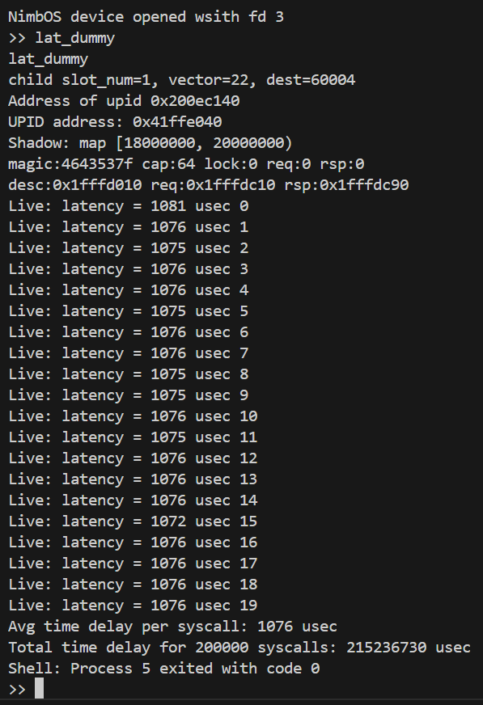

# CRTOS-Uintr 期末报告

## CRTOS 架构

### 总体架构

在 Hypervisor 上运行两个操作系统
- 一个是 Linux 系统，用于提供丰富的系统功能支持
- 一个是 Nimbos，是一个实时操作系统（RTOS），用于运行需要低时延的应用程序
整个系统称为 cRTOS（compounded RTOS），同时具有 RTOS 提供的低时延和 Linux 提供的丰富的系统功能支持  

该架构在[参考文献](#)中提出，原文献使用了完整的 Jailhouse 作为 hypervisor，Nuttx 作为 RTOS，以及一个 patched Linux 版本作为 Linux 功能的来源。  

本大实验的项目基于该项目的一个复现，使用 RVM 作为 hypervisor，保留精简的 jailhouse 的 driver 和 partition 部分用于启动 RVM，使用 Nimbos 作为 RTOS，Linux Kernel 选用了 5.15.0 rc1 的一个 [uintr patched 版本](https://github.com/OS-F-4/uintr-linux-kernel)。  

该架构的关键在于将 RTOS 的系统调用转发给 Linux，再将处理完的结果转发回来。


### 关键部件

将 RTOS 的系统调用转发给 Linux 的方法：
1. 设置共享内存以传递参数和返回值
2. 通过中断来进行通知
   1. RTOS 发送中断给 Linux，让 Linux 程序处理转发的系统调用
   2. Linux 程序处理完后，发送中断通知 RTOS 已经处理完成


## 具体设计实现

[SCF 文档](./scf_doc.md)

## 开发过程

### 性能优化

反向通知的实现：
1. 原系统中没有实现 Linux 反向给 RTOS 发送中断进行通知。
2. Linux 没有提供完整的 sendipi 接口，只有：
```c
void apic_send_IPI_allbutself(unsigned int vector)
{
	if (num_online_cpus() < 2)
		return;

	if (static_branch_likely(&apic_use_ipi_shorthand))
		apic->send_IPI_allbutself(vector);
	else
		apic->send_IPI_mask_allbutself(cpu_online_mask, vector);
}
```
如果向指定 CPU 发送中断必须修改内核。

一些其他问题：
1. IPI Logical / Physical address。
2. Linux 虚拟中断号的实现在新版内核中有所变化。

### 功能拓展

要想支持原生 Linux 程序，需要支持 Linux 的 libc。虽然 MUSL libc 已经比较简单，但是在 Nimbos 上支持仍然比较困难，因为需要支持更多的系统调用


- arch_prctl：https://man7.org/linux/man-pages/man2/arch_prctl.2.html
  - sets architecture-specific process or thread state.
  - OP:
    - ARCH_SET_FS: Set the 64-bit base for the FS register to addr.
  - 可以绕过
- set_tid_address：https://man7.org/linux/man-pages/man2/set_tid_address.2.html
  - used to implement pthread_join(),  pthread_exit() and pthread_create().
  - 可能不能绕过
- brk：https://man7.org/linux/man-pages/man2/brk.2.html
  - Sets the end of the data segment to the value specified byaddr
  - 可以绕过
- mmap and munmap：dual 实现
- mprotect：https://man7.org/linux/man-pages/man2/mprotect.2.html
  - changes the access protections for the calling process's memory pages containing any part of the address range in the interval [addr, addr+size-1].  
  - addr must be aligned to a page boundary.
  - 可以绕过
- rt_sigprocmask：https://www.man7.org/linux/man-pages/man2/sigprocmask.2.html
  - is used to fetch and/or change the signal mask of the calling thread.
  - OP:
    - SIG_UNBLOCK: The signals in set are removed from the current set of blocked signals.
  - 由于 nimbos 没有 signal，可以暂时绕过。
- membarrier：https://man7.org/linux/man-pages/man2/membarrier.2.html
  - issue memory barriers on a set of threads
  - 很复杂，没有必要实现
- ioctl：直通
- writev：直通
- exit_group：exit all threads in a process。需要本地实现。

在 Nimbos 上尝试用绕过的方法实现这些系统调用，但是运行失败。由于 Nimbos 比较简单，缺少很多功能：
1. 用户程序堆
2. 线程
3. 信号
4. 内存保护
5. 完善的内存分配机制  

所以考虑更换一个更完善的 RTOS 可能是更好的选择（Starry），但是由于更换 OS 需要配置的环境和修改的部件过于多，没有办法在期末前完成。

### 移植工作

Starry 是组件化操作系统，所以也许可以将目前的工作提取出来，封装成一个 Crate。虽然无法避免 patch，但是能够减少 patch 的工作量。

目前已经将 SCF 的相关代码封装成了一个 [SCF Crate](https://github.com/cRTOS-Uintr/scf)。

过程中遇到了若干关于设计、功能划分的问题，以及后续移植完成后可以继续优化的点，写在了 [SCF Crate Note](./scf_crate.md) 中。

## 实机测试

在 x14 物理机上用下列程序测试 `sys_write` 的延迟：

```c
for (int i = 0; i < TOTAL_SAMPLES; i++) {
    err = clock_gettime(DEFAULT_CLOCK, &start);
    for (int j = 0; j < CYCLES_PER_SAMPLE; j++) {
        do_write();
    }
    err = clock_gettime(DEFAULT_CLOCK, &end);
    long interval = tsdelta(&end, &start);
    printf("Live: latency = %ld usec %d", interval / CYCLES_PER_SAMPLE, i);
    printf("\n");
    // printf("\033[A\033[2K");
    total += interval;
}
avg = total / TOTAL_SAMPLES;
printf("Avg time delay per syscall: %ld usec\n", avg / CYCLES_PER_SAMPLE);
printf("Total time delay for %d syscalls: %ld usec\n", TOTAL_SAMPLES * CYCLES_PER_SAMPLE, total);
```

其中参数：
- `TOTAL_SAMPLES=20`
- `CYCLES_PER_SAMPLE=10000`


得到的结果：

1. 普通 IPI: ~1346 usec
2. Uintr：~1346 usec

结果相差无几，可能是因为 uintr 通知机制的优化相比系统调用延迟而言很小。


在 Shadow Process 处理 syscall 的逻辑中，把实际的系统调用去掉（即收到请求就立即 push response）过后，进行测试：
1. 普通 IPI：~1076 usec
2. Uintr：~1076 usec

结果还是相差无几，分析原因可能是内存操作（同步）导致的。

目前还没有进一步测试将内存操作去掉过后的延时。将内存操作去掉过后，可能会显示出纳秒级别的区别。

附：其中一次测试的输出：


